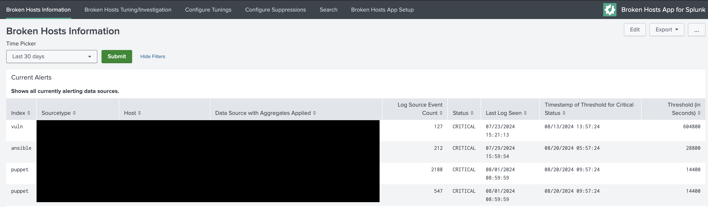
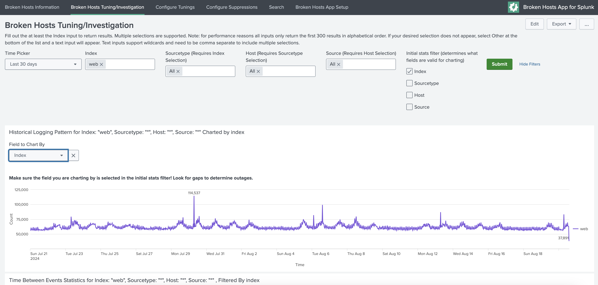

Dashboards
==========

Broken Hosts Dashboard
~~~~~~~~~~~~~~~~~~~~~~

The ``Broken Hosts`` dashboard is the main overview dashboard for the Broken Hosts app. It provides
you with a quick glance into hosts that are not sending data, hosts that are sending data with a
timestamp in the future, Eventtype Aggregations and Suppressions, and your "suppressed" items
(note: suppressed here refers to items with a ``lateSecs`` value of ``0``, meaning to never alert).
Clicking on any of the broken or future hosts will take you to the ``Investigation Dashboard``
where you can get additional information in order to troubleshoot the data.

Tuning/Investigation Dashboard
~~~~~~~~~~~~~~~~~~~~~~~

The ``Tuning/Investigation`` dashboard can be used to troubleshoot why data has stopped coming in for a
particular ``index``/``sourcetype``/``host``/``source`` combination, or help figure out the appropriate time to set lateSecs in expectedTime. 
The filters let you select the data you are interested in, and you can also select the field to aggregate by. This is useful to
determine whether a particular host or source is having issues. You can also identify the
frequency at which data comes into Splunk in order to determine an appropriate ``lateSecs`` value,
and quickly see whether Splunk, or the host itself, was recently stopped or restarted.

Configure Broken Hosts Lookup
~~~~~~~~~~~~~~~~~~~~~~~~~~~~~

.. image:: ../_static/configure_broken_hosts_lookup.png

The ``Configure Broken Hosts Lookup`` dashboard is where you configure the lateSecs for a
particular ``index``/``sourcetype``/``host`` combination. You can also provide comments and an
expiration time for the configuration (if, for example, you have a maintenance window for a
firewall and it is expected to be offline and not sending logs for a certain period of time). You
can also set the ``contact`` field if you're using the ``Broken Hosts Alert - by contact`` search.
